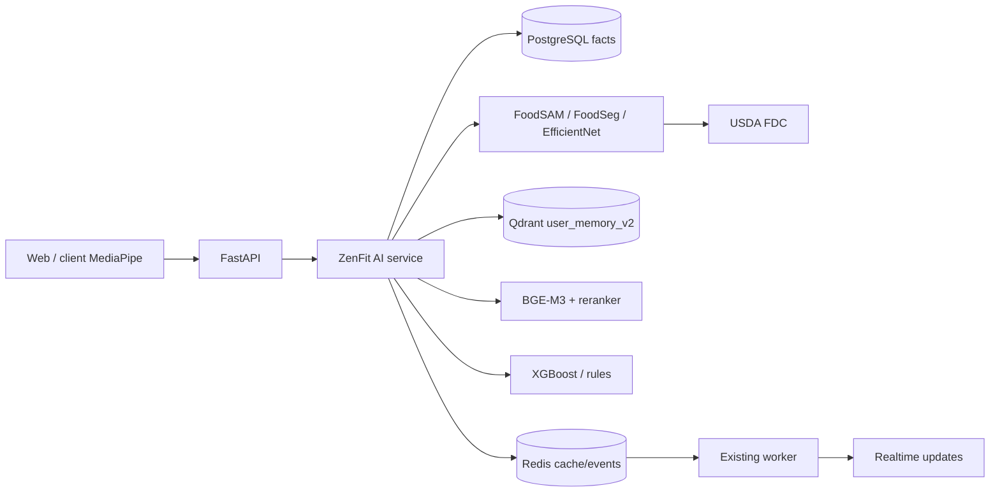

# AI Runtime

Classifier training now uses explicit folder labels, pre-split exact/perceptual deduplication, conservative train-only augmentation, frozen-head training followed by partial-backbone fine-tuning, best-validation-loss restoration, and immutable evidence artifacts.

Open-set safety is a pure decision layer after classifier evidence. It combines top-1 confidence, top-1/top-2 margin, entropy, and optional detector/OOD scores into user-safe decisions without owning model execution. `AI_HEAVY_MODELS_ENABLED=false` is the authoritative runtime kill switch and is checked before every registry load and Meal Scan model path.

Dataset execution now separates immutable `/data/raw/kaggle`, generated `/data/training`, immutable versioned model candidates, development/production activation pointers, and evidence-based promotion gates. No new AI subsystem was introduced.

`MealScanPipeline` validates images, uses FoodSAM regions only when available, otherwise tries whole-image classification, merges canonical detections, estimates non-exact portions, resolves reviewed local nutrition before USDA, and preserves manual correction.

Coach retrieval embeds a query, retrieves 20-30 user-filtered Qdrant points, reranks to 5-8, then combines them with PostgreSQL facts. A missed-workout event is consumed by the existing worker; new predictors can run in shadow mode while the established recommendation path stays active. Prediction loads an XGBoost artifact if present or a deterministic fallback otherwise.

Meal uploads pass validation, segmentation adapters, local classification, conservative portion estimation, USDA lookup/cache, and user confirmation before PostgreSQL persistence. Pose landmarks go directly to joint-angle and exercise state machines; full videos need not reach the server.

`backend/app/ai` is the only AI runtime package. It reuses the canonical database, Redis, Qdrant, events, authentication, and realtime infrastructure; offline training lives outside runtime source in `backend/training`.

Prediction audits live in PostgreSQL `ai_predictions`; scheduled sessions append shadow rows and completed/missed transitions append outcomes. Meal analysis ownership is temporarily stored at `zenfit:meal-analysis:<analysis_id>` in Redis for one hour. Model weights live in a Docker named volume shared by backend and worker. The frontend performs pose detection on-device and sends landmarks at no more than two requests per second.
