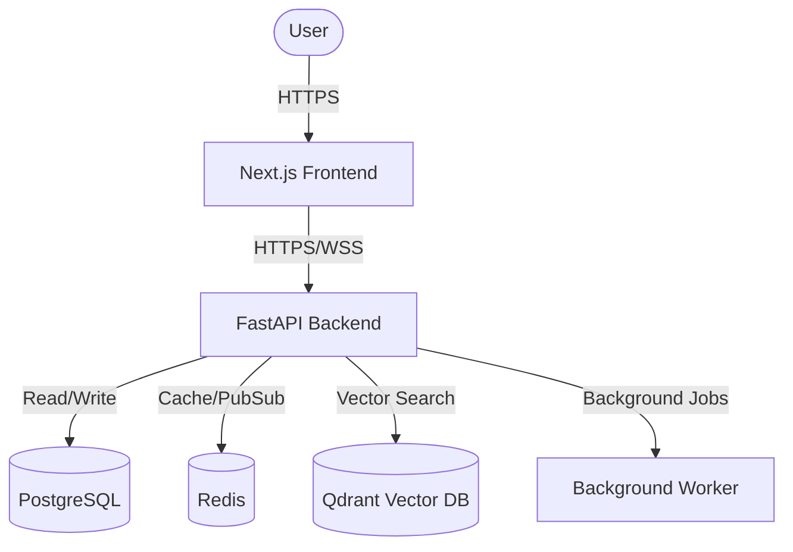

# High-Level Design (HLD)

## 1. Project Overview
ZenFit is a modern, full-stack fitness and wellness application. It provides users with workout tracking, nutrition logging, recovery/sleep monitoring, and personalized wellness recommendations based on a robust backend architecture and data analysis capabilities.

## 2. Goals
- Provide a responsive and intuitive user interface for tracking daily fitness activities.
- Offer data-driven, personalized recommendations to improve user health metrics.
- Maintain a scalable, service-oriented architecture capable of integrating advanced analytics.
- Ensure strict security and privacy for user health data.

## 3. Non-Goals
- Real-time physiological monitoring (e.g., direct smartwatch continuous sync is out of scope for the base architecture).
- Medical diagnosis or clinical recommendations.

## 4. System Context

The system consists of a web-based client, a core API backend, persistent storage, and background processing capabilities.

## 5. Architecture Overview
ZenFit utilizes a layered, modern technology stack:
- **Frontend**: Next.js (React), Tailwind CSS, communicating via REST APIs.
- **Backend**: FastAPI (Python) serving as the core business logic and API gateway.
- **Data Layer**: 
  - PostgreSQL for relational data (users, workouts, meals, logs).
  - Redis for caching and background task queuing.
  - Qdrant for semantic search and embedding storage.

## 6. Major Components
- **User Interface**: Handles user interactions, dashboard rendering, and form submissions.
- **Auth Service**: Manages user registration, login, and JWT token issuance.
- **Core API Service**: Handles CRUD operations for workouts, nutrition, and recovery.
- **Recommendation Engine**: Analyzes user activity and history to provide actionable wellness advice.
- **Data Processing Service**: Manages unstructured data analysis (e.g., meal scan approximations) and semantic search.
- **Realtime Gateway**: Handles WebSocket connections for live updates.

## 7. Frontend Architecture
The frontend is a Next.js application built with a component-driven approach. It uses client-side routing, protected route guards, and local storage for session management. Major modules include:
- `app/workouts/`: Workout tracking and history.
- `app/nutrition/`: Meal logging and targets.
- `app/recovery/`: Sleep and readiness tracking.
- `app/coach/`: Assistant interface for personalized advice.

## 8. Backend Architecture
The FastAPI backend follows a modular monolith structure. Each domain (workouts, nutrition, auth, recommendations) is encapsulated in its own module under `backend/app/modules/`, ensuring clear separation of concerns.

## 9. Data Layer
- **PostgreSQL**: The source of truth for structured user data. Managed via SQLAlchemy ORM and Alembic migrations.
- **Qdrant**: Stores vector embeddings representing user states, activities, or historical contexts for semantic retrieval.
- **Redis**: Provides fast access to session data, rate limiting counts, and message brokering for background workers.

## 10. External Services
- **Nutrition API**: Integrates with external food databases (e.g., USDA) for accurate nutritional information lookup.

## 11. Authentication & Authorization
Authentication is handled entirely in-house using a custom Email/Password strategy.
- Users receive a short-lived access JWT and a long-lived refresh JWT upon login.
- Passwords are securely hashed before storage.
- No third-party OAuth providers are currently integrated.

## 12. Data Flow
**Example Request Flow (Saving a Workout):**
1. User submits workout form on the Frontend.
2. Frontend attaches JWT Bearer token and sends `POST /api/v1/workouts`.
3. Backend validates the token and authorizes the user.
4. Backend parses and validates the payload via Pydantic schemas.
5. The Workout Service writes the record to PostgreSQL.
6. A background task is queued to update the user's readiness score.
7. Backend returns a success response.
8. Frontend updates the UI state.

## 13. Deployment Architecture
The repository is designed to be easily deployed to modern cloud platforms:
- **Frontend**: Deployed to Vercel (or similar CDN/Edge platforms).
- **Backend / Workers**: Containerized via Docker and deployed to PaaS providers (e.g., Render, Railway) or Kubernetes.
- **Databases**: Managed cloud database instances.

## 14. Scalability & Reliability
- Stateless backend APIs allow horizontal scaling of the web server containers.
- Heavy computational tasks or data analysis are offloaded to asynchronous background workers.
- Redis acts as a buffer to prevent database overload during traffic spikes.

## 15. Security
- Complete separation of public assets and private API endpoints.
- Secure HTTP headers, strict CORS policies, and rate-limiting are enforced at the API gateway level.
- Secrets and API keys are strictly managed via environment variables and are never committed to version control.

## 16. Future Extension Points
- Integration with wearable device APIs (e.g., Apple Health, Google Fit).
- Advanced analytics dashboards for long-term trend visualization.
- Enhanced push notifications for activity reminders.
